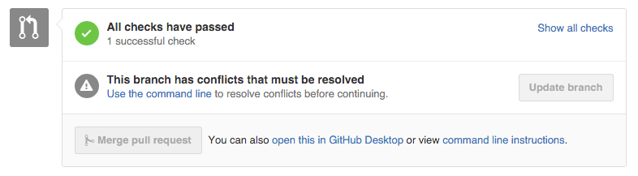
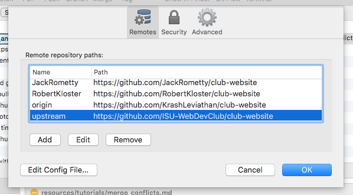
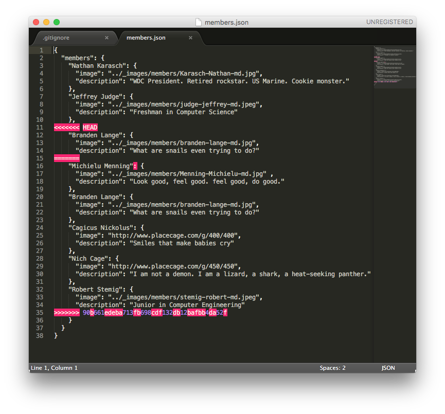
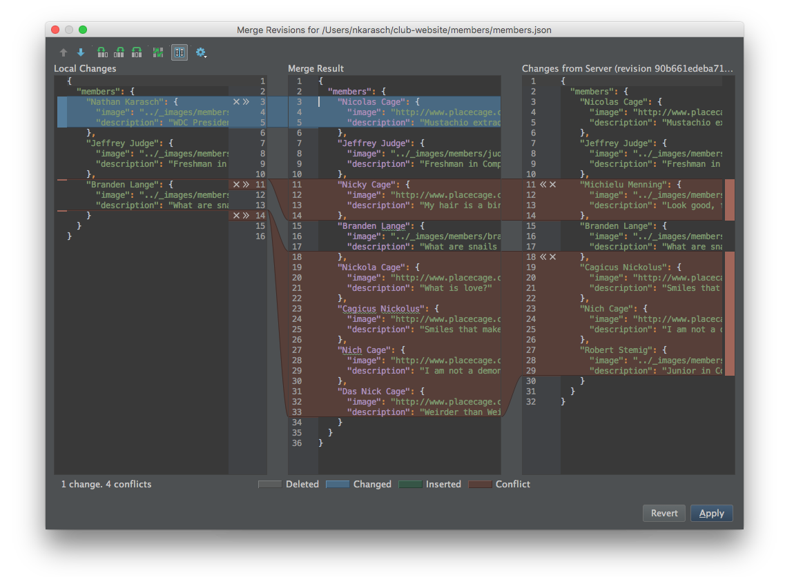

# Handling Merge Conflicts

 By Nathan Karasch - uploaded 8 Oct 2015

-------------------

## Created a pull request and ran into this? ⤴︎

Don't worry! Though sometimes daunting (and almost always annoying), merge conflicts are a normal part of
collaborative programming. Merge conflicts occur when two people are trying to merge pieces of code into the repository
that change the same thing. The git version control system does its best to try to merge code together automatically,
but where there is room for doubt, it defers to the users to resolve the conflicts. In this tutorial I'll be talking
about how to resolve merge conflicts using SourceTree and WebStorm.

## Is there a way to avoid having merge conflicts?

No matter how much you try to avoid it, there will inevitably be times when two people are working on the same piece
of code at the same time. One person's code gets merged before the other, and suddenly the runner-up has merge conflicts!
These conflicts have to be resolved before merging your branch, because you don't want to overwrite something your
fellow collaborator spent his or her valuable time writing.

That being said, there are some things you can do to make merge conflicts less frequent and less painful.

### Coordinate efforts

By splitting up the work in some way, you can try to avoid duplication of efforts. This is why it's important to use
some sort of ticketing system. We use the built-in Issues tracker in GitHub. It provides a way to let everyone know
what needs to be done, and (more importantly) who is taking charge of what. If Sue and Jerry both try to fix the same
bug or add the same feature, one of them is going to end up wasting their time. With tickets (issues), you can "lay
claim" to a certain bug or feature and avoid conflicts.

### Keep pull requests as light as possible

The bigger the pull request (more lines of code changed), the more likely it will conflict with someone else's work.
Give each bug or feature its own ticket instead of rolling a bunch of them together into one. It can turn into a huge
headache when you have a massive pull request that keeps hitting merge conflicts as other team members get their
pull requests merged.

### Communicate

Save yourself hours of wasted effort by communicating with your team! If you *know* you'll be working on the same
section of code as someone else, talk to them. They may want to wait to work on it until you're done, or vice versa.

## How to Resolve Merge Conflicts Using SourceTree and WebStorm

### Step 1: Pull upstream/master into your local branch

In SourceTree, ensure that you are working in the correct local branch, because when you pull another branch into it,
the changes will only affect the active branch. In the left sidebar under **Branches** you can see that
`Nathan_Karasch_member_gridsq...` is bolded, meaning it's the active branch.

If this is your first time pulling from the main repository, you'll need to add it to your list of remote repositories.
In the main menu, click **Repository** > **Repository Settings**. Then click **Add**, and paste in the URL from the main
repository (in our case, it's the `ISU-WebDevClub/club-website` repo). I've given it the name `upstream`. Click **OK**.

If you added `upstream` for the first time, you won't see any of its branches until you *fetch* from `upstream`. To do
that, right click on the `upstream` remote in the sidebar and click **Fetch from upstream**. You'll see a small caret
appear to the left of the remote, and you can expand it to see all the branches in that repository. The `master` branch
is the one we care about.

Finally, to pull `upstream/master` into your local branch, right click `master` and click **Pull upstream/master into [your branch name]**.

After it attempts to pull in the changes from `upstream`, you'll see the following error message. It's basically telling
you what you already know: that you have merge conflicts that have to be resolved before the pulled changes can be
committed.

### Step 2: Find the conflicting file(s)

Identifying the conflicting file(s) is easy. It tells you in the error message, but if you switch to the **Working Copy**
view in the left sidebar, you can see all the files from the pull have been staged except the conflicting one(s).

#### Understanding the added notation

For every conflict in a file, there are three special lines that appear: `<<<<<<< HEAD`, `=======`, and 
`>>>>>>> [revision]`. The stuff in between the angle brackets is the stuff in conflict. The equals sign line separates
the two conflicting pieces of code. The stuff in the upper part is what's in your local branch (on your computer).
The stuff in the lower part is what you're trying to merge into your branch. The goal is to make them both work together,
and then remove the `<<<<<<<`, `=======`, and `>>>>>>>` lines.

### Step 3: Resolve the conflicts

You can do this part manually if you want, but WebStorm actually has a very handy feature that helps to resolve merge
conflicts. In the menu bar, click **VCS** > **Git** > **Resolve Conflicts**. This will bring up a list of any files
with merge conflicts. Pick one and click **Merge**.

Now, instead of seeing the angle bracket and equal sign lines, WebStorm lays it out nicely for you in three panes.
The left pane has local changes, the right pane has changes from the server, and the middle is what your final result
looks like. Any changes in blue are safe -- they're not in conflict, and can be safely applied. Changes in red are the
ones in conflict. You can click either the `X` or the `<<` / `>>` buttons to choose which changes to discard or apply.
However, often you'll need to simply click in the Merge Result box and type in the changes manually to get it just right.

Here you can see I've applied the blue change and discarded the first red change, because I don't want to delete the
"Michielu Menning" entry that was pulled in from the server.

I finished by applying the bottom change from the server, but then I edited it manually to remove the unwanted Nick Cage
entries.

### Step 4: Commit and push your branch

When you switch back to SourceTree, you'll see the conflicting file(s) automatically jump up into the Staged Files area.
It even creates a default commit message for you, outlining which branch you merged into your own and which file(s)
were in conflict.

## Conclusion

Don't be dismayed when you see merge conflicts in your branch! They are a regular part of collaborative software
development, so unless you plan on working alone the rest of your career, you are bound to see these all the time.
Stay ahead of the game by pulling from upstream often, and check the status of your pull request immediately after
you create it. There's no point in a reviewer looking at your code until it is free of conflicts and ready to be merged.

Until then, happy coding!